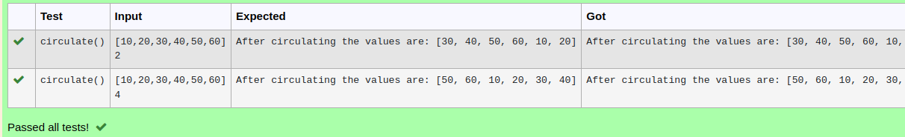

# Circulate-the-values-of-N-variables
## Aim:
To write a python program to circulate the n variables using function concept

## Equipment’s required:
PC
Anaconda - Python 3.7
## Algorithm: 
### Step 1:
Define the function circulate.
### Step 2: 
To calculate,enter the formula.
### Step 3: 
Get the value from the user for the number of rotation.
### Step 4: 
Using the slicing concept rotate the list.
### Step 5: 
Print the values after circulating.
### Step 6:
End the program.
## Program:
```
#Program to circulate N values.
#Developed by:Dhanumalya 
#RegisterNumber:22008657
def circulate():
    l=eval(input())
    n=int(input())
    l=l[n:]+l[ :n]
    print("After circulating the values are:",l)
```
## Output:

## Result:
Thus circulating n variabes using function concept is sucessfully excecuted.
